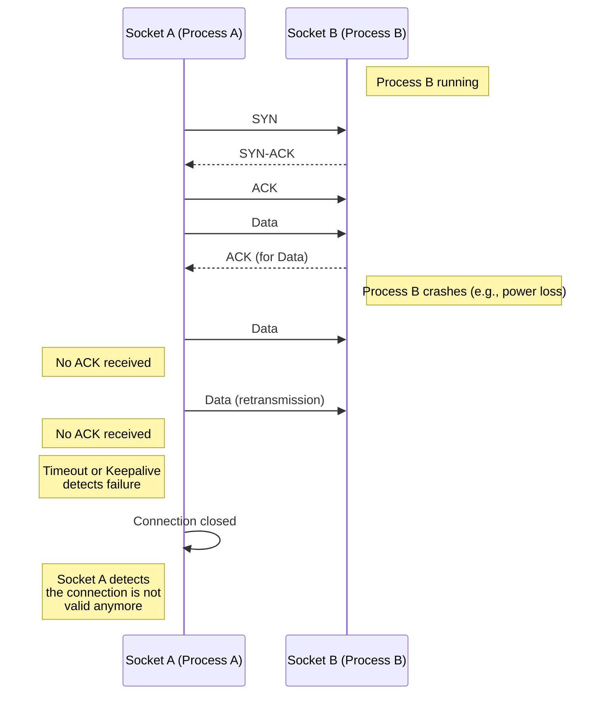

+++ 
date = 2024-07-31
title = "What happens when a TCP process is interrupted?"
tags = ["Computer Networking"]
+++

I was talking to a colleague from work and he presented me the following scenario he faced during a past project: Can it happen that the the recipient of a TCP connection stops responding to requests?

Let's suppose there is a socket A sending data to a socket B over a TCP connection. Suddenly, socket B stops responding. This could happen for different reasons: something terminated the process, or the network channel is not up. What happens, then, in this scenario? Will socket A keep sending data to socket B even though there is no acknowledgements returned?

**Keepalive**

It's possible to associate a set of times with TCP eonnctions. Keepalive is one of then. Socket A can send socket B a keepalive probe packet with no data and the ACK flag on. If there is no response to the keepalive probes, TCP can conclude that the connection is not valid anymore.

One example of configuration a TCP keep alive probe: `sysctl -w net.ipv4.tcp_keepalive_probes=9`. In this case, socket A will conclude that socket B has no valid connection if 9 probes are sent and not replied.

**Timeout**

Timeout is a simplier mechanism. The TCP can be configured with a timeout value. When data is sent, socket A starts a timer and waits for an ACK from socket B, if ACK not not received before the timer expires, TCP assumes it was lost and retransmit the data. Retransmission timeout is specified in [RFC1122]. It's possible to specify the initial retransmission timout (RTO) and and maximum number of retries before giving up by using `tcp_retries1` and `tcp_retries2`[^1], as specified in the Linux kernel.

[RFC1122]: https://datatracker.ietf.org/doc/html/rfc1122#page-90
[^1]: `tcp_retries1` - INTEGER
	This value influences the time, after which TCP decides, that
	something is wrong due to unacknowledged RTO retransmissions,
	and reports this suspicion to the network layer.
	See tcp_retries2 for more details.

    `tcp_retries2` - INTEGER
	This value influences the timeout of an alive TCP connection,
	when RTO retransmissions remain unacknowledged.
	Given a value of N, a hypothetical TCP connection following
	exponential backoff with an initial RTO of TCP_RTO_MIN would
	retransmit N times before killing the connection at the (N+1)th RTO.
	The default value of 15 yields a hypothetical timeout of 924.6
	seconds and is a lower bound for the effective timeout.
	TCP will effectively time out at the first RTO which exceeds the
	hypothetical timeout.

